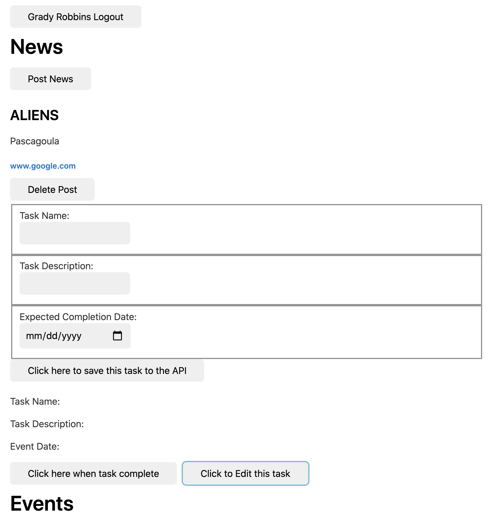
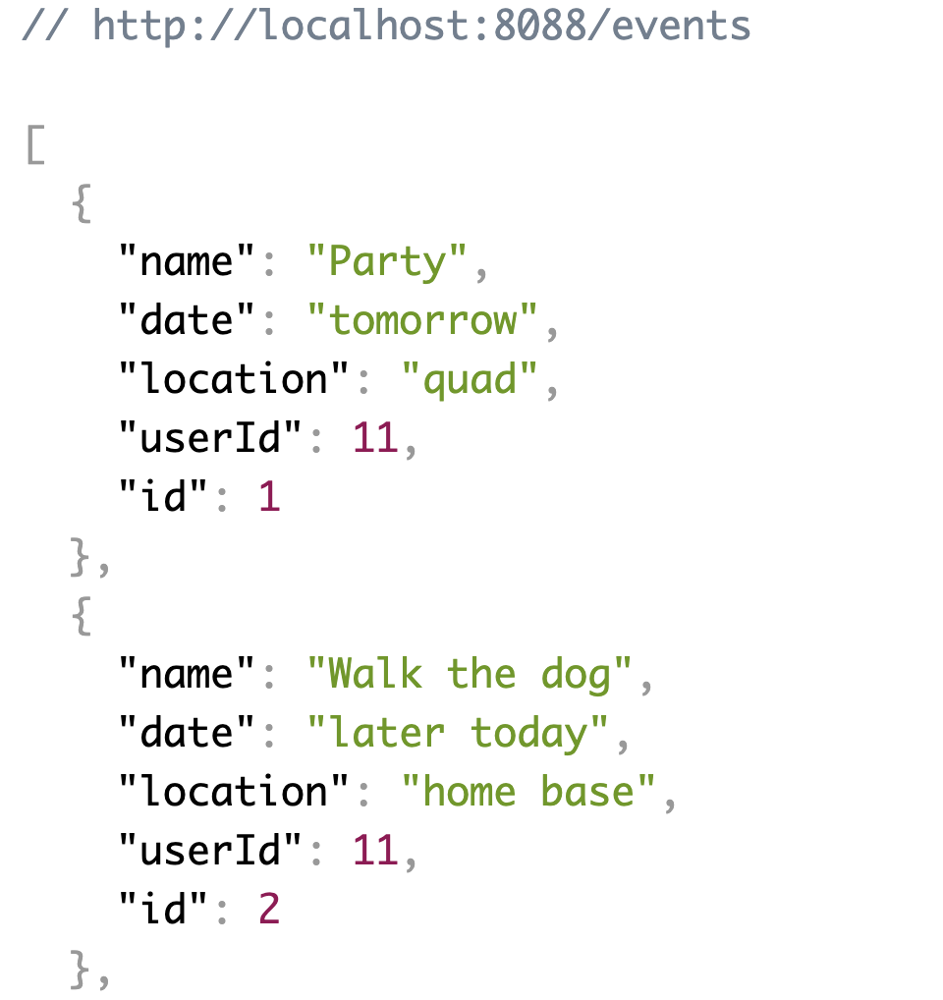

#NUTSHELL
Our Team: <br/>Dolly Anupama <br/>Taylor Gulley<br/>Grady Robbins<br/>Streator Ward<br/>

This application uses grunt, json server, browserify, vanilla javascript, water.css

## To run this application:
1. Clone or Fork the nutshell repository onto your local machine
2. ```cd src/lib```
3. Run ```npm install```
4. Once npm install is done, run ```grunt```
5. ```cd ../../api```
6. Run ```json-server -p 8088 -w database.json``` to get the database running locally
7. ```cd ../dist```
8. Initiate http server ```hs -o``` to launch Nutshell in your browser


## Screengrabs:
### DOM, now using *Water.css*
🌊 A drop-in collection of [CSS styles](https://watercss.netlify.app/) to make simple websites just a little nicer:
 <br/><br/>


### API:


